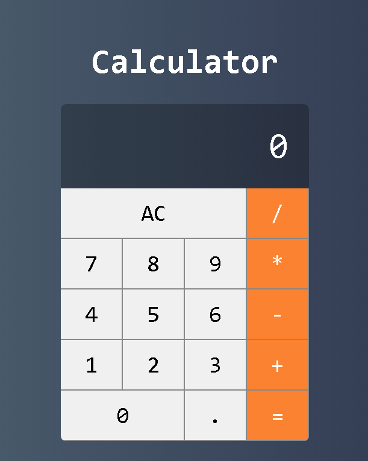

<h1 align="center">
  Vue.js Calculator<br><br>
  
</h1>


Esse é um projeto simples que fiz com o objetivo de praticar e fixar alguns conhecimentos sobre Vue.js, você pode ver ele rodando clicando no link abaixo :arrow_heading_down:

---

### Como executá-lo em sua máquina
Baixe o projeto, instale as dependências e inicie a calculadora seguindo os seguintes passos

```bash
# Clone o repositório em algum diretório de seu computador
$ git clone https://github.com/TiagoDiass/vuejs-calculator.git

# Entre na pasta do projeto
$ cd vuejs-calculator

# Instale as dependências
$ npm install

# Inicie a aplicação
$ npm run serve
```

Após isso a aplicação estará disponivel no seu localhost na porta 8080, basta entrar no seu browser e digitar `http://localhost:8080` para entrar na calculadora, para parar a calculadora basta voltar ao terminal e apertar <kbd>CTRL</kbd>+<kbd>C</kbd>
